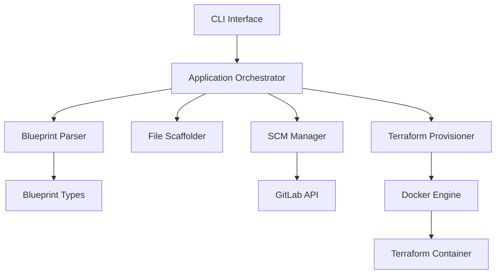

# Architecture

KloneKit follows a modular architecture designed for maintainability, testability, and extensibility.

## High-Level Architecture



## Core Components

### CLI Interface (`cmd/klonekit/`)
The command-line interface built with Cobra framework. Handles:
- Command parsing and flag management
- User input validation
- Help text generation

### Application Orchestrator (`internal/app/`)
The main workflow coordinator that:
- Orchestrates the complete workflow execution
- Manages step sequencing and error handling
- Provides the high-level API for all operations

### Blueprint Parser (`internal/parser/`)
Responsible for:
- YAML blueprint parsing and validation
- Type marshaling and unmarshaling
- Configuration validation

### File Scaffolder (`internal/scaffolder/`)
Handles:
- File generation and template processing
- Variable substitution from blueprint
- Directory structure creation

### SCM Manager (`internal/scm/`)
Manages source control operations:
- GitLab API integration
- Repository creation and management
- Git operations (clone, push, etc.)

### Terraform Provisioner (`internal/provisioner/`)
Orchestrates infrastructure provisioning:
- Docker container management
- Terraform execution in isolated environments
- State file management

## Design Principles

### Separation of Concerns
Each component has a single, well-defined responsibility. Business logic is kept separate from CLI handling.

### Interface-Based Design
External services (GitLab, Docker) are abstracted behind interfaces, enabling testability and future plugin architecture.

### Error Context
All errors are wrapped with context using `fmt.Errorf("...: %w", err)` for better debugging.

### Structured Logging
All logging uses the standard `log/slog` library for consistent, structured output.

## Data Flow

1. **Input Processing**: CLI parses commands and loads blueprint YAML
2. **Validation**: Blueprint structure and required fields are validated
3. **Workflow Execution**: Application orchestrator coordinates the selected workflow
4. **External Integration**: Components interact with GitLab API and Docker as needed
5. **State Management**: Progress and state are tracked throughout execution

## Package Structure

```
klonekit/
├── cmd/klonekit/           # CLI entry point
├── internal/               # Private application code
│   ├── app/               # Main workflow orchestrator
│   ├── parser/            # Blueprint parsing
│   ├── provisioner/       # Terraform Docker execution
│   ├── scaffolder/        # File generation
│   └── scm/               # GitLab integration
└── pkg/blueprint/         # Blueprint data structures
```

## Next Steps

- Learn about [Blueprint Structure](blueprints.md)
- Understand the [Overview](overview.md)
- Start with [Installation](../tasks/installation.md)