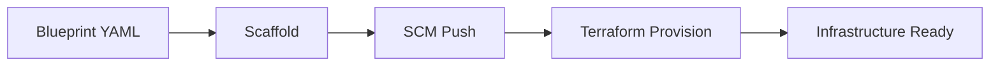

# Overview

KloneKit is a blueprint-driven DevOps automation tool designed to streamline the process of creating GitLab repositories and provisioning AWS infrastructure through Terraform.

## What is KloneKit?

KloneKit orchestrates common DevOps workflows by automating the typical process of:

1. **Scaffolding** - Generate Terraform files with variable substitution
2. **SCM Integration** - Create GitLab repositories and push code
3. **Provisioning** - Execute Terraform in isolated Docker containers

## Key Benefits

### Declarative Configuration
Define your entire infrastructure and GitLab project setup in a single YAML blueprint file. This approach ensures consistency and repeatability across environments.

### Workflow Orchestration
Execute individual workflow steps or run the complete pipeline. KloneKit provides flexibility to match your deployment process.

### Resilient Execution
Built-in error recovery and state management allow you to resume interrupted workflows without starting from scratch.

### Isolated Execution
Terraform runs in Docker containers, ensuring consistent behavior regardless of local environment differences.

## How It Works

1. **Blueprint Definition** - Create a YAML file describing your project structure, GitLab repository, and infrastructure requirements
2. **File Scaffolding** - Generate Terraform files with variables substituted from the blueprint
3. **Repository Management** - Create GitLab repository and push the scaffolded files
4. **Infrastructure Provisioning** - Execute Terraform in a Docker container to provision AWS resources

## Next Steps

- Learn about [Architecture](architecture.md)
- Understand [Blueprint Structure](blueprints.md)
- Get started with [Installation](../tasks/installation.md)